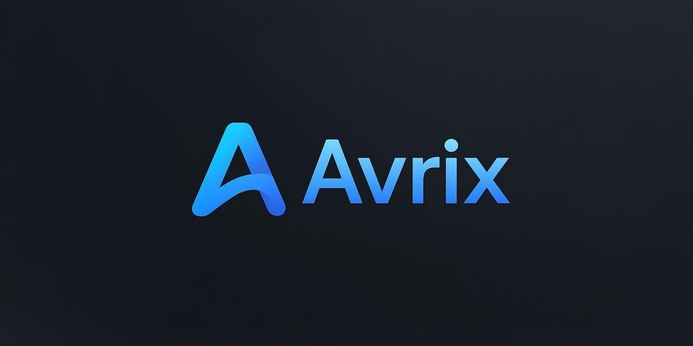
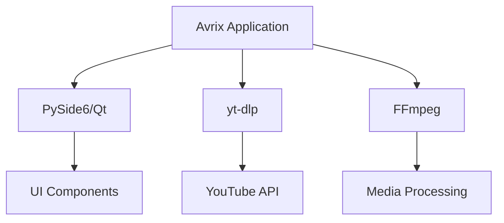

<div align="center">




### *A Professional Desktop Application for YouTube Media Downloads*

[](https://www.python.org/)
[](https://www.qt.io/qt-for-python)
[](LICENSE)
[](/)

[](https://github.com/yassine-krichen/avrix-downloader/stargazers)
[](https://github.com/yassine-krichen/avrix-downloader/network/members)

[Features](#-features) • [Installation](#-installation) • [Usage](#-usage) • [Documentation](#-documentation) • [Download](#-download-standalone-executable)

---

</div>

## 📋 Table of Contents

- [Overview](#-overview)
- [Key Features](#-features)
- [Screenshots](#-screenshots)
- [Installation](#-installation)
  - [For End Users (Executable)](#for-end-users-windows-executable)
  - [For Developers (Source)](#for-developers-run-from-source)
- [Usage Guide](#-usage)
- [Architecture](#-architecture)
- [Project Structure](#-project-structure)
- [Concurrent Downloads](#-concurrent-downloads)
- [Queue Management](#-queue-management)
- [Troubleshooting](#-troubleshooting)
- [Building from Source](#-building-from-source)
- [Roadmap](#-roadmap)
- [Contributing](#-contributing)
- [Credits](#-credits)
- [License](#-license)

---

## 🌟 Overview

**Avrix** is a feature-rich, cross-platform desktop application designed for seamless YouTube content downloads. Built with modern Python technologies and following SOLID principles, it offers a professional-grade user experience with a sleek, themeable interface.

### Why Avrix?

| Feature | Avrix | Others |
|---------|-------|--------|
| 🎨 Modern UI | ✅ Dark/Light themes | ❌ Basic interfaces |
| ⚡ Concurrent Downloads | ✅ Up to 10 simultaneous | ❌ Single at a time |
| 📋 Queue System | ✅ Batch processing | ❌ Limited support |
| 🎯 Quality Options | ✅ Up to 4K | ⚠️ Limited options |
| 💾 Format Support | ✅ MP4, MP3, WebM | ⚠️ Basic formats |
| 🔄 Live Updates | ✅ Real-time progress | ❌ Basic indicators |
| 🎨 Thumbnails | ✅ Download & embed | ❌ Not available |
| 📝 Subtitles | ✅ Multiple languages | ❌ Limited support |

---

## ✨ Features

### 🎯 Core Capabilities

<table>
<tr>
<td width="50%">

#### 📥 Download Options
- **Single Videos** - Quick, one-click downloads
- **Entire Playlists** - Batch download complete playlists
- **Queue System** - Download multiple items sequentially
- **Concurrent Downloads** - Up to 10 simultaneous downloads
- **Resume Support** - Continue interrupted downloads

</td>
<td width="50%">

#### 🎨 Format & Quality
- **MP4 Video** - High-quality video downloads
- **MP3 Audio** - Extract audio only
- **Quality Selection** - 4K, 1080p, 720p, 480p, 360p
- **Automatic Best** - Smart quality selection
- **Format Conversion** - Powered by FFmpeg

</td>
</tr>
<tr>
<td>

#### 🖥️ User Interface
- **Modern Design** - Clean, professional interface
- **Dark/Light Themes** - Eye-friendly themes
- **Real-time Progress** - Speed, ETA, file size
- **Thumbnail Preview** - Visual feedback
- **Drag & Drop** - Intuitive URL input

</td>
<td>

#### ⚙️ Advanced Features
- **Subtitle Downloads** - Multiple languages
- **Thumbnail Embedding** - Auto-embed artwork
- **Metadata Preservation** - Keep video info
- **Settings Persistence** - Remember preferences
- **System Notifications** - Desktop alerts

</td>
</tr>
</table>

---

## 📸 Screenshots

<div align="center">

### Dark Theme Interface


*Professional dark mode with Avrix branding*

### Download Progress


*Real-time progress tracking with speed and ETA indicators*


### Queue Management


*Batch processing with intelligent queue system*

</div>

> **Note:** Screenshots showcase the modern UI with embedded thumbnails, progress tracking, and queue management.

---

## 💻 Installation

### For End Users (Windows Executable)

**🎯 One-Click Installation - No Python Required!**

1. **Download the latest release:**
   ```
   📦 Avrix_v1.0_Setup.zip
   ```
   [Download from Releases](https://github.com/yassine-krichen/avrix-downloader/releases)

2. **Extract and run the installer:**
   ```
   Avrix_Installer/
   ├── Avrix.exe           ← Double-click to run (portable)
   └── Install_Avrix.bat   ← Or run installer for system integration
   ```

3. **First-time setup:**
   - Avrix will check for FFmpeg
   - If needed, follow the automatic download prompt
   - That's it! Start downloading 🚀

**System Requirements:**
- Windows 10 or later (64-bit)
- ~100 MB free disk space
- Internet connection

---

### For Developers (Run from Source)

#### Prerequisites

<table>
<tr>
<td width="33%">

**🐍 Python**
```bash
Python 3.8+
```
[Download](https://www.python.org/downloads/)

</td>
<td width="33%">

**🎬 FFmpeg**
```bash
Required for processing
```
[Download](https://ffmpeg.org/download.html)

</td>
<td width="33%">

**📦 Git**
```bash
For cloning
```
[Download](https://git-scm.com/)

</td>
</tr>
</table>

#### Quick Start

```bash
# 1. Clone the repository
git clone https://github.com/yassine-krichen/avrix-downloader.git
cd avrix-downloader

# 2. Create virtual environment (recommended)
python -m venv venv

# Windows
venv\Scripts\activate

# macOS/Linux
source venv/bin/activate

# 3. Install dependencies
pip install -r requirements.txt

# 4. Run the application
python main.py
```

#### FFmpeg Installation

<details>
<summary><b>🪟 Windows</b></summary>

**Option 1: Automatic (Recommended)**
```bash
python setup_ffmpeg.py
```

**Option 2: Manual**
1. Download from [ffmpeg.org](https://ffmpeg.org/download.html)
2. Extract and add to PATH
3. Restart terminal

**Option 3: Chocolatey**
```bash
choco install ffmpeg
```

</details>

<details>
<summary><b>🍎 macOS</b></summary>

**Homebrew (Recommended)**
```bash
brew install ffmpeg
```

**MacPorts**
```bash
sudo port install ffmpeg
```

</details>

<details>
<summary><b>🐧 Linux</b></summary>

**Ubuntu/Debian**
```bash
sudo apt update
sudo apt install ffmpeg
```

**Fedora**
```bash
sudo dnf install ffmpeg
```

**Arch Linux**
```bash
sudo pacman -S ffmpeg
```

</details>

---

## 🚀 Usage

### Quick Start Guide

1. **Launch Avrix**
   ```bash
   # From source
   python main.py
   
   # Or run the executable
   Avrix.exe
   ```

2. **Enter YouTube URL**
   - Paste any YouTube video or playlist URL
   - Auto-detection identifies single videos vs playlists

3. **Configure Download**
   - **Format:** MP4 (Video) or MP3 (Audio)
   - **Quality:** 4K, 1080p, 720p, 480p, 360p, or Best
   - **Options:** Subtitles, Thumbnails

4. **Choose Destination**
   - Default: `Downloads/YoutubeDownloader`
   - Click "Browse" to change location

5. **Start Downloading**
   - Click "Download" for immediate start
   - Or "Add to Queue" for batch processing

### Feature Walkthroughs

#### 🎬 Single Video Download
```
1. Paste URL → 2. Select Quality → 3. Click Download → 4. Done!
```

#### 📋 Playlist Processing
```
1. Paste Playlist URL
2. App detects all videos
3. Choose download method:
   - Download Now (immediate)
   - Add to Queue (batch)
4. Track progress per video + total
```

#### ⚡ Concurrent Downloads
```
1. Settings → Max Concurrent Downloads (1-10)
2. Add multiple items to queue
3. Watch them download simultaneously
4. Progress tracked for each item
```

#### 🎵 Audio Extraction
```
1. Select MP3 format
2. Choose quality (higher = better audio)
3. Automatic conversion with FFmpeg
4. Output: Clean .mp3 files
```

---

## 🏗️ Architecture

Avrix is built with clean architecture principles and SOLID design patterns:

```
┌─────────────────────────────────────────────────┐
│              User Interface Layer                │
│  ┌──────────────┐  ┌────────────────────────┐  │
│  │  Main Window │  │  Progress/Queue Widgets │  │
│  └──────────────┘  └────────────────────────┘  │
└────────────┬────────────────────────────────────┘
             │
┌────────────▼────────────────────────────────────┐
│           Business Logic Layer                   │
│  ┌────────────────┐  ┌──────────────────────┐  │
│  │ Facade Pattern │  │  Download Manager     │  │
│  │   (Simplified  │  │  Queue Manager        │  │
│  │    Interface)  │  │  Concurrent Manager   │  │
│  └────────────────┘  └──────────────────────┘  │
└────────────┬────────────────────────────────────┘
             │
┌────────────▼────────────────────────────────────┐
│            Core Services Layer                   │
│  ┌────────────┐  ┌──────────────────────────┐  │
│  │  yt-dlp    │  │  FFmpeg Integration       │  │
│  │  Wrapper   │  │  Format Builder           │  │
│  └────────────┘  └──────────────────────────┘  │
└──────────────────────────────────────────────────┘
```

### Key Design Patterns

| Pattern | Purpose | Implementation |
|---------|---------|----------------|
| **Facade** | Simplified API | `DownloaderFacade` class |
| **Observer** | Event handling | Qt Signals/Slots |
| **Strategy** | Format selection | `FormatBuilder` |
| **Factory** | Object creation | Download worker factory |
| **Singleton** | Config management | Settings manager |

### Technology Stack



---

## 📁 Project Structure

```
avrix-downloader/
│
├── 📄 main.py                      # Application entry point
├── 📄 build_exe.py                 # Executable builder script
├── 📄 setup_ffmpeg.py              # FFmpeg auto-installer
├── 📄 requirements.txt             # Python dependencies
├── 📄 README.md                    # This file
│
├── 📁 core/                        # Business logic layer
│   ├── __init__.py
│   ├── downloader.py              # Core download engine (400+ lines)
│   ├── concurrent_manager.py      # Concurrent download orchestration
│   ├── queue_manager.py           # Queue processing system
│   ├── queue_item.py              # Queue item data class
│   ├── facade.py                  # Simplified API interface
│   ├── format_builder.py          # yt-dlp format specifications
│   ├── utils.py                   # Helper utilities
│   └── notification_service.py    # Desktop notifications
│
├── 📁 ui/                          # User interface layer
│   ├── __init__.py
│   ├── main_window.py             # Main application window (900+ lines)
│   ├── progress_widget.py         # Download progress display
│   ├── queue_widget.py            # Queue management UI
│   ├── theme_manager.py           # Dark/Light theme system
│   └── ui_state_manager.py        # UI state coordination
│
├── 📁 config/                      # Configuration
│   └── settings.json              # User preferences (auto-generated)
│
├── 📁 assets/                      # Application assets
│   ├── Avrix_dark.png             # Dark theme logo
│   ├── Avrix_light.png            # Light theme logo
│   ├── avrix_icon.ico             # Windows icon
│   └── README.md                  # Asset documentation
│
├── 📁 dist/                        # Build output (generated)
│   └── Avrix_Installer/
│       ├── Avrix.exe              # Standalone executable
│       ├── Install_Avrix.bat      # Windows installer
│       └── Uninstall_Avrix.bat    # Windows uninstaller
│
└── 📁 docs/                        # Documentation
    ├── ARCHITECTURE.md            # System architecture
    ├── BUILD_INSTRUCTIONS.md      # Building executables
    ├── PROJECT_SUMMARY.md         # Project overview
    └── QUICK_START.md             # Quick start guide
```

### Module Responsibilities

<details>
<summary><b>Core Module (Backend)</b></summary>

- **downloader.py** - Main download engine using yt-dlp Python API
- **concurrent_manager.py** - Manages multiple simultaneous downloads
- **queue_manager.py** - Processes download queue sequentially
- **facade.py** - Provides simplified interface for UI layer
- **format_builder.py** - Constructs yt-dlp format specifications
- **utils.py** - URL validation, config management, formatting

</details>

<details>
<summary><b>UI Module (Frontend)</b></summary>

- **main_window.py** - Main application window and layout
- **progress_widget.py** - Real-time progress visualization
- **queue_widget.py** - Queue display and management
- **theme_manager.py** - Theme switching and styling
- **ui_state_manager.py** - Coordinates UI element states

</details>

---

## ⚡ Concurrent Downloads

Avrix supports downloading multiple items simultaneously for maximum efficiency:

### How It Works

```
┌─────────────────────────────────────┐
│      Concurrent Download System      │
├─────────────────────────────────────┤
│  Thread Pool (Configurable 1-10)   │
│                                      │
│  ┌──────────┐  ┌──────────┐        │
│  │Download 1│  │Download 2│ ...    │
│  │  Thread  │  │  Thread  │        │
│  └──────────┘  └──────────┘        │
│       ↓              ↓              │
│  ┌──────────────────────────────┐  │
│  │   Queue Manager              │  │
│  │   • Processes pending items  │  │
│  │   • Manages thread lifecycle │  │
│  │   • Handles completions      │  │
│  └──────────────────────────────┘  │
└─────────────────────────────────────┘
```

### Configuration

**Via Settings Menu:**
```
Settings → General → Max Concurrent Downloads (1-10)
```

**Benefits:**
- ⚡ **Speed:** Download multiple videos simultaneously
- 🎯 **Efficiency:** Maximize bandwidth utilization
- 🔄 **Flexibility:** Adjust based on system resources
- 📊 **Tracking:** Individual progress for each download

---

## 📋 Queue Management

The intelligent queue system allows batch processing of multiple downloads:

### Features

| Feature | Description |
|---------|-------------|
| **Add to Queue** | Queue multiple items for sequential processing |
| **Reorder** | Drag and drop to change download order |
| **Pause/Resume** | Control queue processing |
| **Clear Queue** | Remove all pending items |
| **Persistent** | Queue survives application restarts |
| **Status Tracking** | Pending, Downloading, Completed, Failed |

### Queue States

```
Pending → Downloading → Completed ✓
               ↓
            Failed ✗ (with retry option)
```

---

## 🔧 Troubleshooting

<details>
<summary><b>❌ FFmpeg Not Found</b></summary>

**Problem:** Application can't find FFmpeg

**Solutions:**
1. Run automatic installer: `python setup_ffmpeg.py`
2. Install manually and add to PATH
3. Place `ffmpeg.exe` in Avrix directory
4. Restart application after installation

**Verification:**
```bash
ffmpeg -version
```

</details>

<details>
<summary><b>🔴 Download Fails</b></summary>

**Common Causes:**
- ❌ Invalid or private video URL
- 🌐 Network connectivity issues
- 🔒 Region-restricted content
- 🚫 Age-restricted videos

**Solutions:**
1. Verify URL is accessible in browser
2. Check internet connection
3. Try lower quality settings
4. Update yt-dlp: `pip install --upgrade yt-dlp`

</details>

<details>
<summary><b>🐌 Slow Downloads</b></summary>

**Optimization Tips:**
- Reduce concurrent downloads (try 2-3)
- Close bandwidth-heavy applications
- Check network speed
- Try different quality settings
- Disable subtitles/thumbnails temporarily

</details>

<details>
<summary><b>💾 Out of Disk Space</b></summary>

**Prevention:**
- Monitor download destination free space
- Clean up old downloads regularly
- Change destination to drive with more space
- Use MP3 format for audio-only (smaller files)

</details>

<details>
<summary><b>🖥️ Application Won't Start</b></summary>

**Source Installation:**
```bash
# Reinstall dependencies
pip install -r requirements.txt --force-reinstall

# Check Python version
python --version  # Should be 3.8+
```

**Executable:**
- Check Windows Defender/Antivirus
- Run as Administrator
- Download fresh copy from releases

</details>

---

## 🔨 Building from Source

Create your own standalone executable:

### Quick Build

```bash
# Automated build script
python build_exe.py
```

### Manual Build (Advanced)

```bash
# Install PyInstaller
pip install pyinstaller

# Build single-file executable
pyinstaller --name=Avrix \
  --windowed \
  --onefile \
  --icon=assets/avrix_icon.ico \
  --add-data="assets;assets" \
  --add-data="config;config" \
  --hidden-import=yt_dlp \
  --hidden-import=PySide6 \
  main.py

# Output: dist/Avrix.exe
```

### Build Output

```
dist/Avrix_Installer/
├── Avrix.exe           # ~60 MB standalone executable
├── Install_Avrix.bat   # Windows installer script
├── Uninstall_Avrix.bat # Uninstaller script
└── README.txt          # User instructions
```

**See:** [BUILD_INSTRUCTIONS.md](BUILD_INSTRUCTIONS.md) for detailed guide

---

## 🗺️ Roadmap

### ✅ Completed (v1.0)

- [x] Core download functionality
- [x] MP3/MP4 format support
- [x] Quality selection (up to 4K)
- [x] Playlist downloads
- [x] Queue management system
- [x] Concurrent downloads (up to 10)
- [x] Dark/Light themes
- [x] Progress tracking with ETA
- [x] Subtitle downloads
- [x] Thumbnail embedding
- [x] Settings persistence
- [x] Desktop notifications
- [x] Windows executable build

### 🚧 In Progress (v1.1)

- [ ] Download history tracking
- [ ] Search & filter in queue
- [ ] Automatic yt-dlp updates
- [ ] Proxy support
- [ ] Custom output templates

### 🔮 Planned (v2.0)

- [ ] Browser extension integration
- [ ] Advanced audio codec options (FLAC, WAV)
- [ ] Batch URL import from file
- [ ] Download scheduler
- [ ] Mobile companion app

### 💡 Under Consideration

- [ ] Multi-language support (i18n)
- [ ] Chromecast integration
- [ ] Format conversion tools
- [ ] Plugin system
- [ ] Command-line interface (CLI)

**Want a feature?** [Open an issue](https://github.com/yassine-krichen/avrix-downloader/issues) or contribute!

---

## 🤝 Contributing

We welcome contributions from the community! Here's how you can help:

### Ways to Contribute

- 🐛 **Report Bugs:** Open detailed issue reports
- 💡 **Suggest Features:** Share your ideas
- 📝 **Improve Documentation:** Fix typos, add examples
- 🔧 **Submit Code:** Pull requests are welcome
- 🌍 **Translations:** Help localize Avrix
- ⭐ **Star the Project:** Show your support

### Development Setup

```bash
# Fork and clone
git clone https://github.com/YOUR_USERNAME/avrix-downloader.git
cd avrix-downloader

# Create feature branch
git checkout -b feature/amazing-feature

# Make your changes
# ... code ...

# Test thoroughly
python main.py

# Commit with clear messages
git commit -m "Add: Amazing new feature"

# Push and create PR
git push origin feature/amazing-feature
```

### Code Guidelines

- Follow PEP 8 style guidelines
- Add docstrings to functions/classes
- Include type hints where appropriate
- Write meaningful commit messages
- Test your changes thoroughly
- Update documentation as needed

---

## 🎓 Credits

### Core Technologies

<table>
<tr>
<td align="center" width="25%">
  <br/>
  <b>Python</b><br/>
  <sub>Core Language</sub>
</td>
<td align="center" width="25%">
  <br/>
  <b>Qt/PySide6</b><br/>
  <sub>UI Framework</sub>
</td>
<td align="center" width="25%">
  <br/>
  <b>yt-dlp</b><br/>
  <sub>Download Engine</sub>
</td>
<td align="center" width="25%">
  <br/>
  <b>FFmpeg</b><br/>
  <sub>Media Processing</sub>
</td>
</tr>
</table>

### Dependencies

- **[yt-dlp](https://github.com/yt-dlp/yt-dlp)** - Feature-rich YouTube downloader
- **[PySide6](https://www.qt.io/qt-for-python)** - Official Python Qt bindings
- **[FFmpeg](https://ffmpeg.org/)** - Multimedia framework
- **[PyInstaller](https://www.pyinstaller.org/)** - Executable packaging

### Inspiration & Resources

- Qt Documentation & Examples
- yt-dlp Community & Contributors
- Python Packaging Authority (PyPA)
- Open Source Community

---

## 📄 License

This project is licensed under the **Educational License**.

```
Copyright (c) 2025 Yassine Krichen

Permission is granted for educational and personal use only.
Commercial use requires explicit permission from the author.
```

### Important Legal Notes

⚠️ **YouTube Terms of Service:** This tool is for personal, educational use only. Users are responsible for complying with YouTube's Terms of Service.

⚠️ **Content Rights:** Respect copyright laws. Only download content you have the right to download.

⚠️ **Fair Use:** Be aware of fair use laws in your jurisdiction.

---

## 🌟 Acknowledgments

Special thanks to:

- **yt-dlp Team** for the incredible download engine
- **Qt/PySide6** for the powerful UI framework
- **FFmpeg Developers** for media processing capabilities
- **Open Source Community** for inspiration and support
- **Beta Testers** for valuable feedback

---

## 📞 Support & Contact

<div align="center">

### Get Help

[](docs/)
[](https://github.com/yassine-krichen/avrix-downloader/issues)
[](https://github.com/yassine-krichen/avrix-downloader/discussions)

### Connect

[](https://github.com/yassine-krichen)
[](mailto:your.email@example.com)

---

### ⭐ Show Your Support

If you find Avrix useful, please consider:

- ⭐ **Starring** the repository
- 🐦 **Sharing** with friends
- 📝 **Writing** a review
- 💝 **Contributing** code or ideas

<br/>

**Made with ❤️ by yassine krichen, for everyone**

<br/>

[](https://github.com/yassine-krichen/avrix-downloader/stargazers)

</div>

---

<div align="center">
<sub>Built with Python, Qt, and a passion for great software</sub>
</div>
