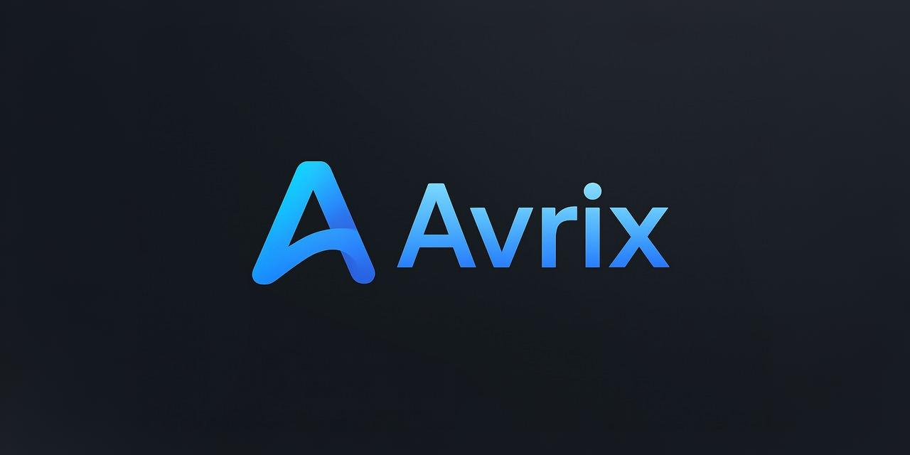

<div align="center">



### *A desktop app for downloading YouTube video and audio*

[](LICENSE)
[](/)

</div>

---

## Overview

Avrix is an Electron desktop app for downloading YouTube videos and audio.
It's built on [yt-dlp](https://github.com/yt-dlp/yt-dlp) under a Next.js UI,
with a local FastAPI backend doing the actual download work. See
[docs/ARCHITECTURE.md](docs/ARCHITECTURE.md) for how the pieces fit
together.

## Features

- **MP4 video or MP3 audio**, quality up to 4K (or "best available")
- **Two download policies**: `strict_quality` (exact format, no fallback,
  requires ffmpeg) or `best_effort` (adds a looser fallback attempt and
  skips unavailable fragments — good default for flaky streams)
- **Queue system** with configurable concurrency (1–10 simultaneous
  downloads), reordering, retry, and clear-finished/clear-all
  — or a "direct mode" for a single one-off download
- **Subtitles** (multi-language) and **thumbnail embedding**
- **Dark/light theme**
- Settings persist across restarts

## Installation

### End users

Download the latest installer from
[Releases](https://github.com/yassine-krichen/avrix-downloader/releases)
(`Avrix-Setup-<version>.exe`) and run it. No Python, Node, ffmpeg, or
JavaScript runtime required: ffmpeg and a JS runtime (deno, which yt-dlp needs
to unlock YouTube formats) are bundled. Windows only for now.

The installer is not code-signed, so Windows SmartScreen may show "Windows
protected your PC". Click **More info**, then **Run anyway**.

To update, download and run the installer from the newest release; it
replaces the old version and keeps your settings and queue.

### Running from source / building your own installer

See [docs/BUILD_INSTRUCTIONS.md](docs/BUILD_INSTRUCTIONS.md).

## Usage

1. Paste a YouTube video, Shorts, or playlist URL.
2. Pick format (video/audio), quality, and download policy.
3. Optionally enable subtitles or thumbnail embedding.
4. **Download** for an immediate single download, or **Add to Queue** to
   batch it with others — queued items run concurrently up to your configured
   limit.

Default download location is `<your Downloads folder>/Avrix`; change it in
Settings.

## Project structure

```
avrix_sidecar_backend/   FastAPI backend — settings, queue, yt-dlp download logic
avrix_desktop_frontend/  Next.js renderer (static export, no server at runtime)
electron/                Electron shell: window, IPC bridge, packaging config
docs/                    Architecture and build docs
assets/                  Icons, banners
```

## Troubleshooting

**A queue item shows "Failed"** — the reason is printed under the item
(for example a bot check, an unavailable video, or a quality that does not
exist). Fix the cause, then press Start again to retry failed items.

**"Strict quality video download requires ffmpeg"** — switch to
`best_effort`. The installer bundles ffmpeg, so this only happens when
running from source without ffmpeg on PATH.

**Downloads fail intermittently with 403s** — use `best_effort` mode; it
retries with a looser format.

**Downloads stop working after a YouTube change** — yt-dlp ships fixes
frequently, and the installer contains a fixed yt-dlp version. Download the
newest installer from Releases (maintainers: see "Updating yt-dlp before a
release" in docs/BUILD_INSTRUCTIONS.md). If running from source, run
`pip install -r requirements.txt` in `avrix_sidecar_backend/` after pulling.

## Contributing

Issues and PRs welcome. Backend changes should keep
`avrix_sidecar_backend/tests/` passing (`pytest`); frontend changes should
keep `npm run lint` and `npm run build` passing in `avrix_desktop_frontend/`.

## License

[MIT](LICENSE). Users are responsible for complying with YouTube's Terms
of Service and applicable copyright law.
